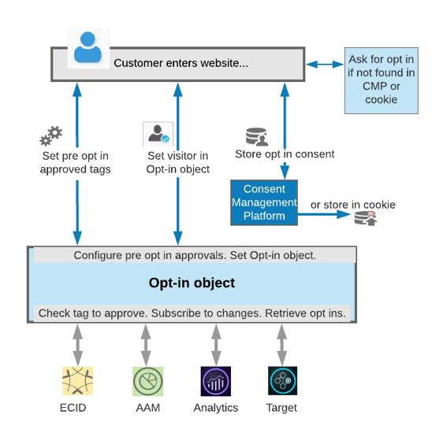

# Use Opt-In to Control Experience Cloud Activities Based on User Consent

The Adobe Opt-in Object is an extension of the Adobe Experience Platform Identity Service, designed to help you control whether and which Experience Cloud solutions can create cookies on web pages or initiate beacons, based on end user consent.

## The Basics of Opt-In

An important aspect of privacy regulations is the acquisition and conveyance of user consent over how their personal data may be used and by whom. The latest version of the Identity Service includes functionality, which sits between the user (the UI) and the Adobe solutions and provides conditional firing (e.g., pre and post consent) of Adobe Experience Cloud solution tags based on whether consent by the end user has been given. This is shown in the following image:

Opt-in is basically the gatekeeper... or is it the keymaster? You decide.

It boils down to this:

**If Opt-in is enabled in the Identity Service (via a Boolean variable), it delays the Experience Cloud solution libraries from firing tags or setting cookies until consent has been given for that solution.**

Opt-in also allows you to decide if any tags fire *before* user consent as well, and then this consent information (along with the consent given by the end user) is stored, so that it can be used on subsequent hits. Storage of the consent is available in the Opt-in options, or you can integrate with a CMP and have it store consent selections.

## Enabling and Configuring Opt-In

Opt-in also is most easily configurable with Adobe Experience Platform Launch. View the following short video to see how.

>[!VIDEO](https://video.tv.adobe.com/v/26431/?quality=12)

If you are not using Launch, you can set Opt-in’s configuration in the initialization of the global Visitor object, as shown in the [documentation](https://marketing.adobe.com/resources/help/en_US/mcvid/getting-started.html).

## Implementing Opt-In on the Page

All of this setup and backend stuff is just in preparation for providing an interface for the site visitors to be presented with consent options. This UI can be built by you, or you can use a CMP (Consent Management Platform) partner to create the UI.

When setting up a UI to use Opt-in to gather consent, it should be configured to call APIs that will hook into Opt-in and inform it to give consent to some or all Adobe Experience Cloud solutions. Detailed information regarding these APIs can be found in the [Opt-in Reference documentation](https://marketing.adobe.com/resources/help/en_US/mcvid/api.html). Additional information about Opt-in is also in the surrounding documentation pages.

## Opt-In Demo

In the following video, see a quick demo of Opt-in working on the page, and how it can affect whether or not the Experience Cloud solutions can set cookies, initiate beacons, etc.

>[!VIDEO](https://video.tv.adobe.com/v/26432/?quality=12)

**NOTE:** It is important to note that at the time of the writing of this article, Opt-in has not been built into the libraries for all of the Experience Cloud solutions. The libraries that are currently supported for Opt-in are:

* Identity Service
* Analytics
* Audience Manager
* Target
