# Add Adobe Target's Visual Experience Composer (VEC)

In this lesson, you will enable the Target Visual Experience Composer (VEC) for Mobile apps.

[Adobe Target](https://docs.adobe.com/content/help/en/target/using/target-home.html) is the Adobe Experience Cloud solution that provides everything you need to tailor and personalize your customers' experience, so you can maximize revenue on your web and mobile sites, apps, social media, and other digital channels.

The Visual Experience Composer (VEC) for Native Mobile Apps lets you create activities and personalize content on native mobile apps in a do-it-yourself fashion without continuous development dependencies and app-release cycles.

In the lesson [Add Extensions](launch-add-extensions.md), you added the Target VEC extension to your Launch property. In the lesson [Install the Mobile SDK](launch-install-the-mobile-sdk.md) you imported the extension into the sample application. Only a few minor updates are required to start setting up activities in Target's mobile visual experience composer!

>[!IMPORTANT] Both the Target and Target VEC Launch extensions are required to use the Target VEC in your mobile application.

## Learning Objectives

At the end of this lesson, you will be able to:

* Enable the sample app for the Target VEC
* Add parameters to the Target VEC request
* Pair your device with the VEC
* Create an activity using the VEC

## Prerequisites

To complete the lessons in this section, you must:

* Complete the lessons in [Configure Launch](launch-create-a-property.md) section.
* Have Approver-level access to the Adobe Target interface

## The App Load request

Target will fire an "app load" request when the app first loads because of the settings we selected when we configured the Target VEC extension. This request prefetches all Target VEC activities that you  created for your app.

In Android studio, filter Logcat to "Target r" to show the Target requests and responses. Notice the parameters for the application name and version. All Target VEC activities that you create will automatically be targeted to these properties.

   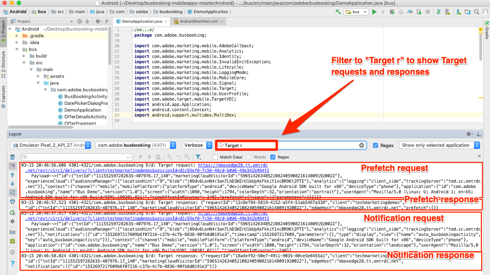

## Add Parameters

As you just saw in the last exercise, app Lifecycle metrics are automatically included as parameters in the Target VEC request. You can also add custom parameters to the requests, globally or for specific views in the app.

**To add custom parameters globally**

1. In Android Studio, open `DemoApplication` file.
1. Import the Target VEC extension by adding `import ACPTargetVEC` beneath the existing import
1. Add the following sample code in the `onCreate()` function, before the extensions are registered. This example code shows how regular parameters, profile parameters, product (or entity) parameters, and order parameters can be added to the TargetVEC request. This example uses static values, while in your actual app you would likely want to use dynamic variables to populate the values. And of course, you would only want to populate the parameters that are relevant to all views:

   ```java
   Map<String, String>targetParams = new HashMap<>(); //params
   targetParams.put( "param1", "value1");
   Map<String, String>taregtProfileParams = new HashMap<>(); //profile params
   taregtProfileParams.put("profilekey1","profilevalue1");

   TargetVEC.setGlobalRequestParameters(new TargetParameters.Builder()
            .parameters(targetParams)
            .profileParameters(taregtProfileParams)
            .product(new TargetProduct("1234", "furniture"))
            .order(new TargetOrder("12343", 123.45, Arrays.asList("100", "200")))
            .build());
   ```

1. You may notice errors in Android Studio, since the parameter code above requires the following imports, which you need to add to the file:

   ```java
   import com.adobe.marketing.mobile.TargetOrder;
   import com.adobe.marketing.mobile.TargetProduct;
   import com.adobe.marketing.mobile.TargetParameters;
   import java.util.Arrays;
   import java.util.Map;
   import java.util.HashMap;
   ```

   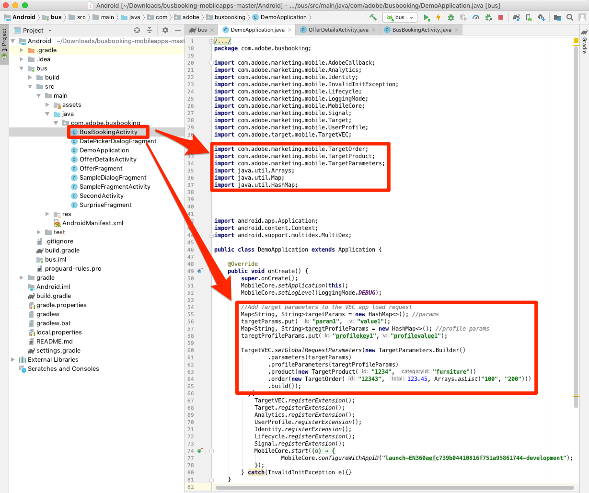

Now that you've added parameters to the app, it's time to confirm they are being passed in the request.

**To verify the parameters**

1. Save the Android Studio project
1. Rebuild the app and wait for it to reopen in the Emulator
1. Open the Logcat pane of Android Studio
1. Filter to show all statements with "Target r"
1. The custom parameters you just added should be visible in the request

   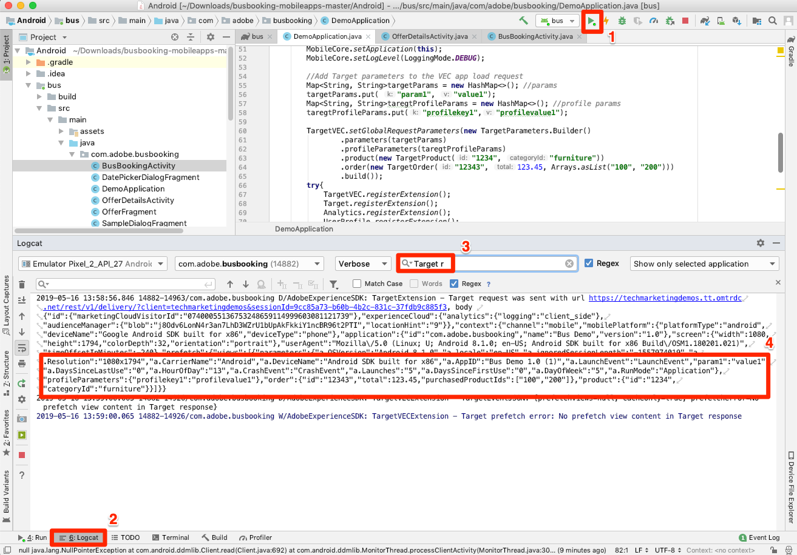

For more information, and details on how to pass parameters with specific views, see [the documentation](https://docs.adobe.com/content/help/en/target/using/implement-target/mobile-apps/composer/mobile-visual-experience-composer-android.html#parameters).

## Pairing the Mobile App with the Target Interface

In order to create VEC activities in the Target interface, you must first pair Target with your app. This pairing is achieved with the use of deep links.

### Creating the Deep Link

Android supports the use of [Deep links and Android App Links](https://developer.android.com/training/app-links/deep-linking) to create URLs that go directly to specific locations in your app. You probably already use these in your app. If so, you can use your existing URL structure to pair with Target. In this tutorial, you will review the deep link pre-defined in the Bus Booking app, confirm that it is working, and then use it to pair your app with the Target VEC for Mobile Apps.

**To review the Deep link setup**

1. In Android Studio, open the AndroidManifest.xml file
1. Note that there is already an Intent Filter configured for the deep link scheme of the Bus Booking app
1. Note that the `Host` and `Scheme` are already set to `com.adobe.example.busbooking` and `http`, respectively. This means that a url like `http://com.adobe.example.busbooking` when opened in the Emulator should automatically open the sample app

   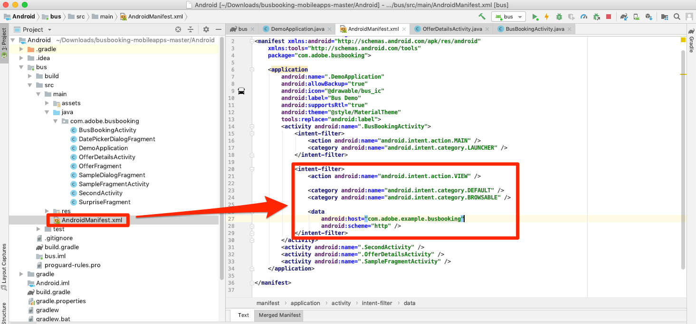

The next step is to confirm that the deep link scheme is working

### Verify the deep link

Now let's make sure that the deep link will open the app in the emulator. You may have your preferred way of running adb commands which you can certainly use.

**To verify the deep link using adb (Mac&reg;)**

1. Make sure the Android emulator is running
1. Close the Bus Booking app if it is already open
1. Open a Terminal window
1. Navigate to your Android platform-tools directory: `cd Library/Android/sdk/platform-tools/`
1. Confirm that your emulator is attached: `./adb devices`
1. Open the adb shell: `./adb shell`
1. In the adb shell test the deep link: `am start -W -a android.intent.action.VIEW -d "http://com.adobe.example.busbooking" "com.adobe.busbooking"`
1. Confirm that the Bus Booking app has launched in the emulator

   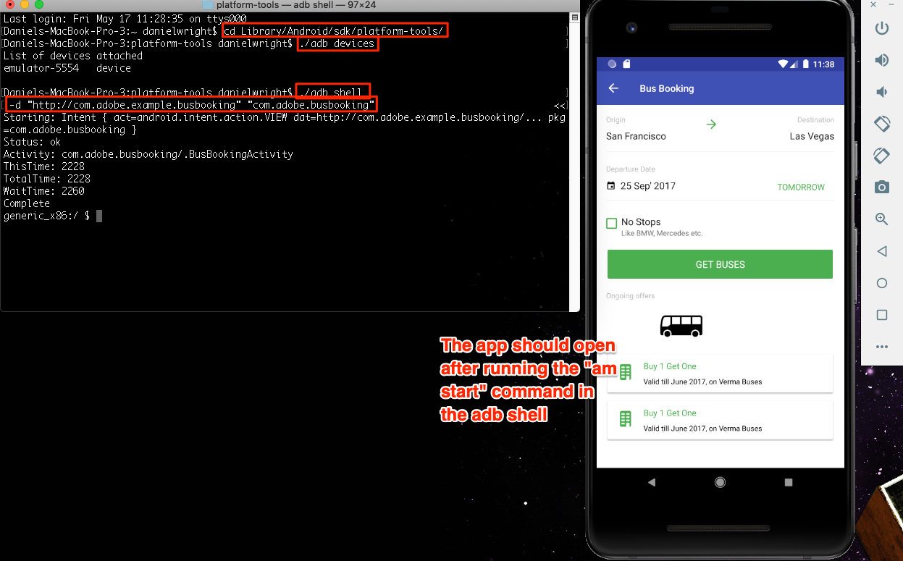

Now that your deep link structure is set up, you are ready to use the Target VEC to set up activities!

## Create an activity in the Mobile VEC

Now let's create an activity in the Target interface.

**To Create an Activity with the Target VEC**

1. Log into the [Adobe Experience Cloud](https://experiencecloud.adobe.com)
1. Use the solution switcher to go to Target

   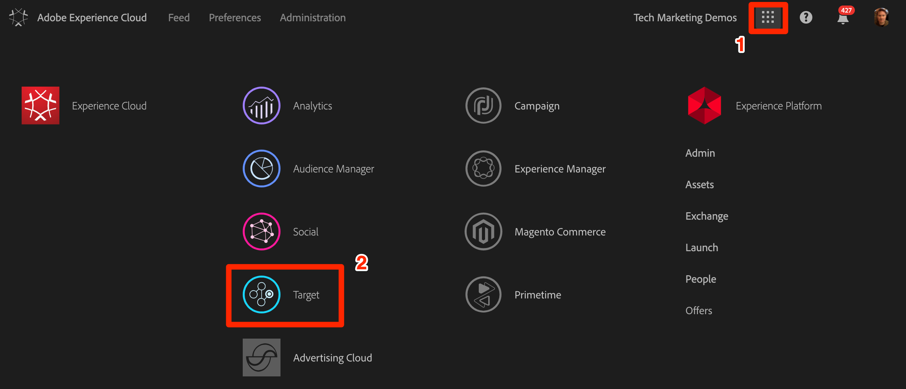

1. Launch Target

   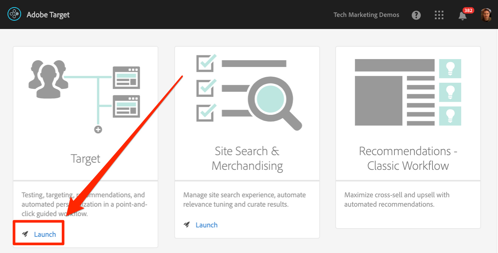

1. Click the **[!UICONTROL Create Activity]** button and select **[!UICONTROL A/B Test]**
1. Select **[!UICONTROL Mobile App]**
1. Make sure **[!UICONTROL Visual]** is selected under **[!UICONTROL Choose Experience Composer]**
1. Click the **[!UICONTROL Next]** button
  
   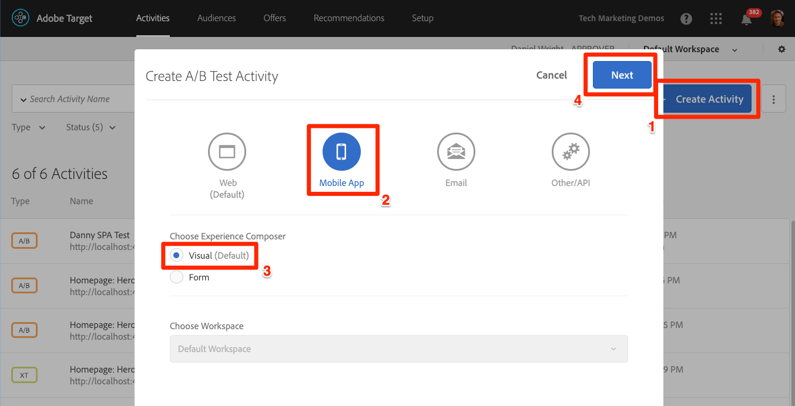

1. On the **[!UICONTROL Select an app to use]** screen, click **[!UICONTROL Add New App]**

   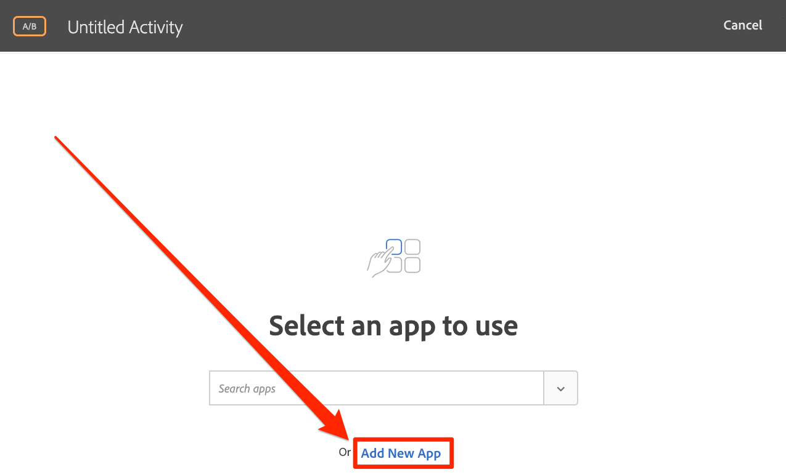

1. Enter the url scheme you just defined in the  **[!UICONTROL Enter URL scheme]** field, e.g. `http://com.adobe.example.busbooking/`
1. Click **[!UICONTROL Create Deep Link]**

   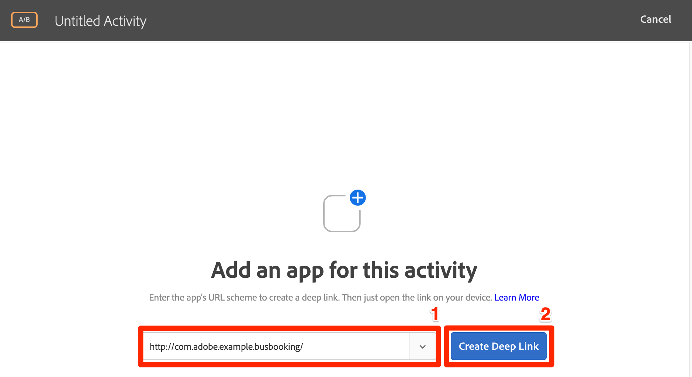

    >[!NOTE] You have a few options to send the deep link to the app. You can:
    >
    >   1. Email the deep link to a valid email address and then open the link with an email application on the device
    >   1. Take a photo of the QR code from your Android Device (in our tutorial, the device would have to be linked to Android Studio)
    >   1. Copy the deep link from the Target interface and send it to the device however you would like

1. Click on the **[!UICONTROL Copy & Send Link]** tab.
1. Click on the generated URL (note that clicking on the URL will automatically copy it to your clipboard)

   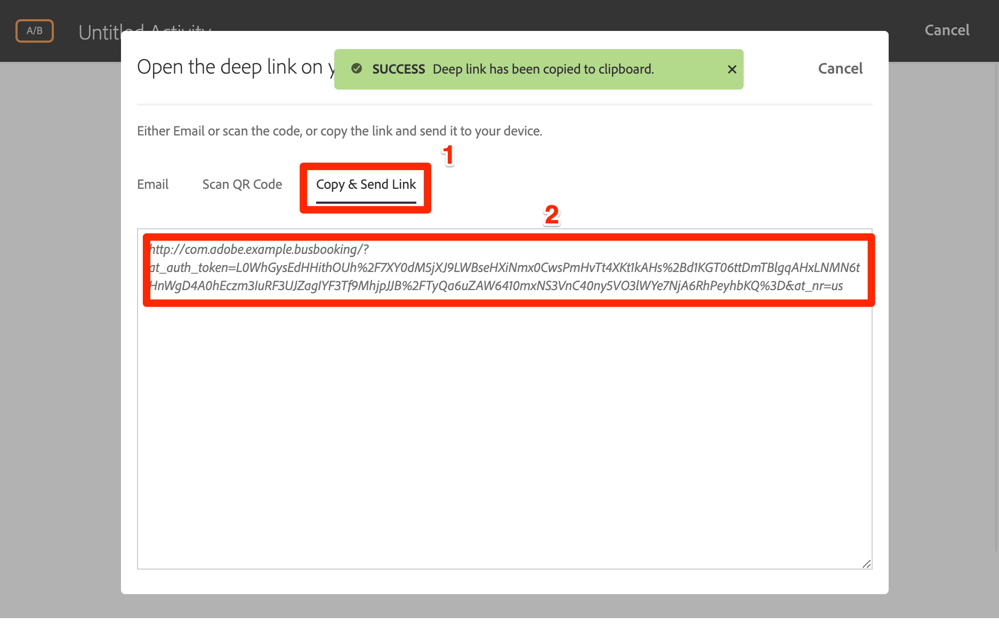

1. Open a Terminal window (or switch back to it if you still have it open)
1. Navigate to your Android platform-tools directory (you may already be here): `cd Library/Android/sdk/platform-tools/`
1. Confirm that your emulator is attached: `./adb devices`
1. Open the adb shell: `./adb shell`
1. In the adb shell, replace [YOUR_TARGET_URL_WITH_TOKEN] in the following command with the URL you just copied to your clipboard: `am start -W -a android.intent.action.VIEW -d "[YOUR_TARGET_URL_WITH_TOKEN]" "com.adobe.busbooking"`
1. After the App has loaded, switch back to your browser tab where you have Target opened. You should see your app loaded in the VEC.
1. Click on text and image assets in your app and you should see options to edit and replace them!

    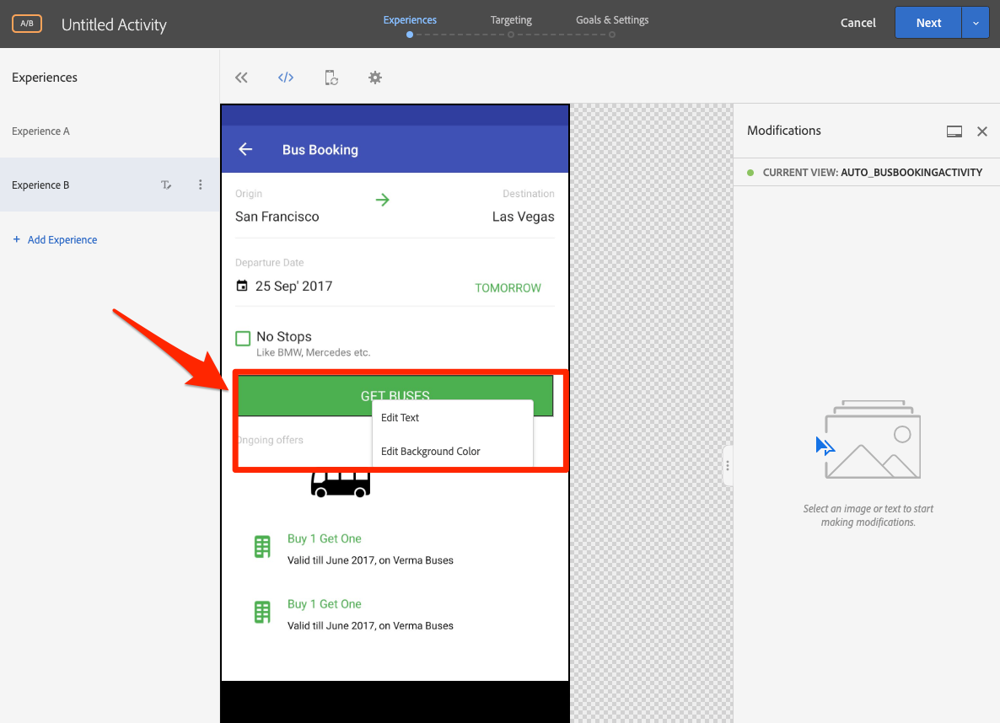

    > [!TIP] If you don't see the Mobile VEC automatically open in the Target interface after opening the deep link in the mobile device, here are some things to try:
    >
    >   1. Make sure you are using the exact same URL in the Target interface and didn't accidentally clip off any characters. When running the command in the adb shell, make sure the URL is in quotation marks
    >
    >
    >   1. Confirm that you added the additional dependencies to the build.gradle file that are required by the Target VEC. These dependencies should have been added during the [Install the Mobile SDK lesson](https://docs.adobe.com/content/help/en/core-services-learn/implementing-in-mobile-android-apps-with-launch/configure-launch/launch-install-the-mobile-sdk.html#update-the-buildgradle-file)
    >
    >
    >   1. Try clearing the Data stored in the app detailed in the picture below
    >
    >       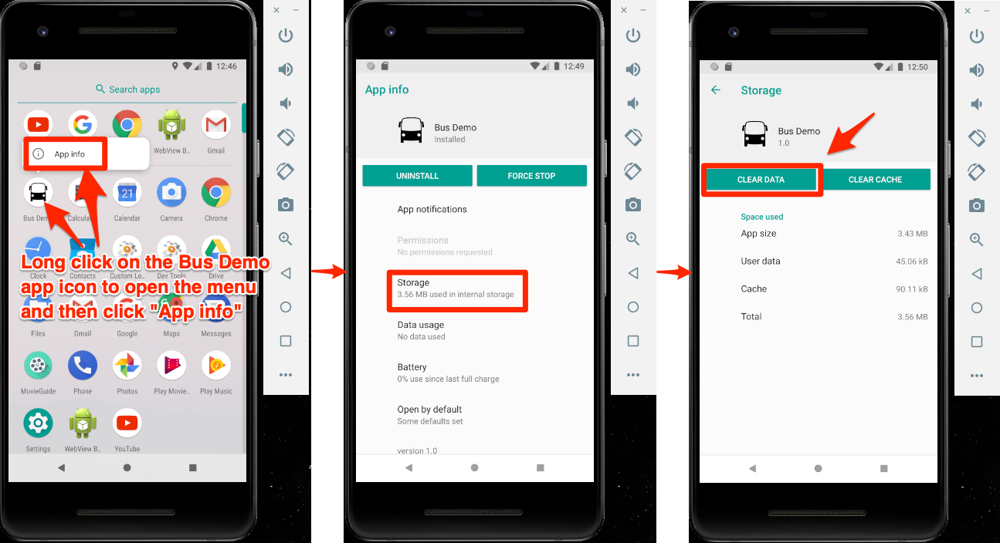

1. Make some changes to the first screen in your app
1. Now position the Emulator next to the browser with the VEC open
1. Navigate to a different screen in the app and notice how the VEC updates with the Emulator!
1. You can make updates to multiple views in your app, in a single activity!

    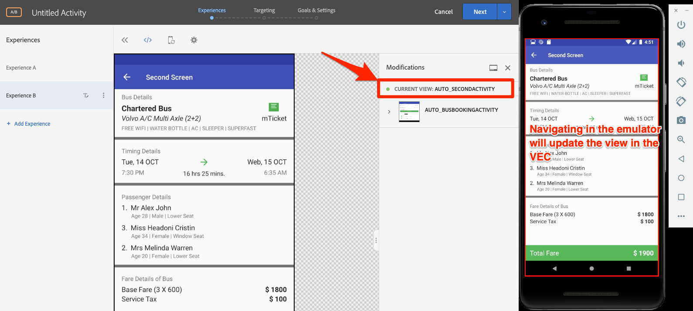

1. You can also visually add click-tracking metrics!
1. Save and Approve your activity and verify that you can see it in the sample app

Pairing the device with the VEC is a one-time action. When you create more activities in the future on the same device, you will just be able to select the device from a list, as pictured below:

 

>[!TIP] If you have a device open, but it is "Unavailable" in the selection menu, try closing and reopening the app on the emulator or device.

## Building Audiences based on Lifecyle metrics

Lifecycle metrics built-in metrics about the visitor's usage of your app that are automatically included in calls made by the Adobe Mobile SDK. You can easily build audiences in Target based on these metrics.

**To create an audience**

1. In the Target interface, click **Audiences** in the top navigation
1. Click the **Create Audience** button

   

1. Name the Audience `Launches < 5`
1. Click **Add Rule > Custom**

   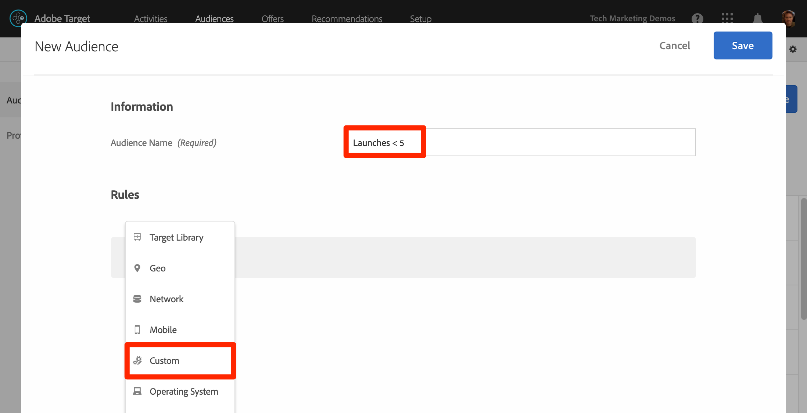

1. In the first dropdown, select the **a.Launches** parameter. All of the Lifecycle metric parameters begin with the "a." prefix. We will Target content based on the number of app Launches the user has, which is an excellent way to target first time users of your app with an instructional, first-time-user-experience (FTUE).
1. In the next dropdown, select **is less than**
1. In the third dropdown, enter **5**
1. Click **Save**

   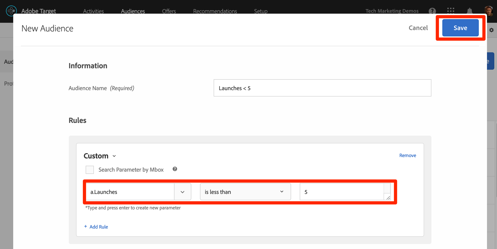

Note that there are a huge variety of out-of-the-box audience building options in Target. Additionally, you can send up custom data in the Target request for audience-building, use audiences shared from other Experience Cloud solutions such as Audience Manager and Analytics, and CRM data shared to Target using the Customer Attributes feature of the People Core Service.
  
[Next "Add Adobe Target" >](target.md)