# Overview

A collection of how-to videos and tutorials to make you a power-user of Adobe Experience Cloud Core Services

## Web Implementation with Adobe Experience Platform Launch

<table>
<tr>
  <td><a href="https://docs.adobe.com/content/help/en/experience-cloud/implementing-in-websites-with-launch/implement-solutions/target.html">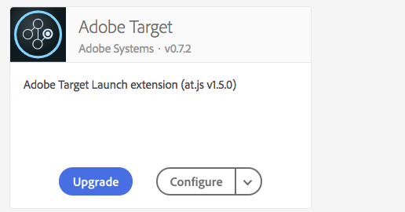</a> <a href="https://docs.adobe.com/content/help/en/experience-cloud/implementing-in-websites-with-launch/implement-solutions/target.html">Implement in Websites with Launch</a></td>
  <td><a href="launch-web/migrate-from-dynamic-tag-manager-to-launch.md">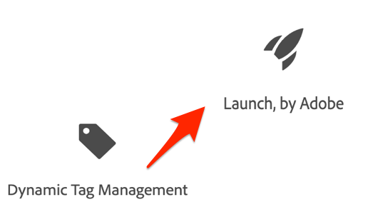</a> <a href="launch-web/migrate-from-dynamic-tag-manager-to-launch.md">Migrate from Adobe Dynamic Tag Manager to Launch</a></td>
  <td><a href="https://docs.adobe.com/content/help/en/experience-cloud/implementing-in-websites-with-launch/configure-launch/launch-switch-environments.html">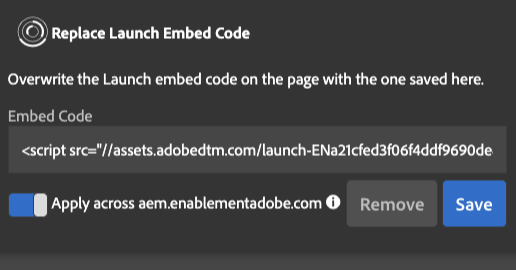</a> <a href="https://docs.adobe.com/content/help/en/experience-cloud/implementing-in-websites-with-launch/configure-launch/launch-switch-environments.html">Switch Launch Environments with the Debugger</a></td>
  <td> </td>
</tr>
</table>

## Mobile Implementation with Adobe Experience Platform Launch

<table>
<tr>
  <td><a href="https://docs.adobe.com/content/help/en/experience-cloud/implementing-in-mobile-ios-swift-apps-with-launch/index.html">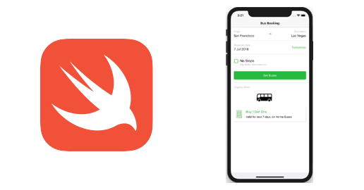</a> <a href="https://docs.adobe.com/content/help/en/experience-cloud/implementing-in-mobile-ios-swift-apps-with-launch/index.html">Implement in iOS Swift&trade; Apps</a></td>
  <td><a href="https://docs.adobe.com/content/help/en/experience-cloud/implementing-in-mobile-ios-objective-c-apps-with-launch/index.html">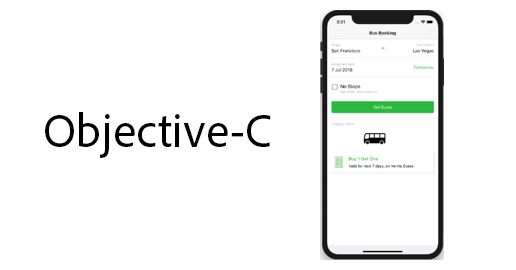</a> <a href="https://docs.adobe.com/content/help/en/experience-cloud/implementing-in-mobile-ios-objective-c-apps-with-launch/index.html">Implement in iOS Objective-C Apps</a></td>
  <td> <a href="https://docs.adobe.com/content/help/en/experience-cloud/implementing-in-mobile-android-apps-with-launch/index.html">Implement in Android&trade; Apps</a></td>
  <td><a href="launch-mobile/create-mobile-properties-launch-feature-video-setup.md">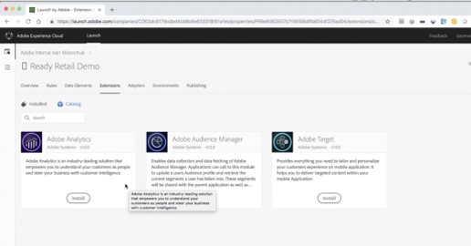</a> <a href="launch-mobile/create-mobile-properties-launch-feature-video-setup.md">Create Mobile Properties in Launch</a></td>
</tr>
<tr>  
  <td><a href="launch-mobile/use-dependency-managers-with-mobile-sdk.md">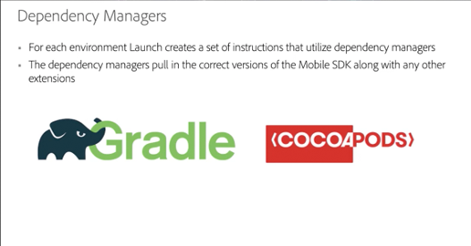</a> <a href="launch-mobile/use-dependency-managers-with-mobile-sdk.md">Use Dependency Managers for the AEP SDK</a></td>
  <td> </td>
  <td> </td>
  <td> </td>
</tr>
</table>

## Experience Cloud ID Service

<table>
<tr>  <td><a href="id-service/use-opt-in-to-control-experience-cloud activities-based-on-user-consent.md">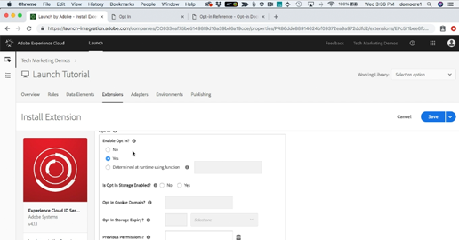</a> <a href="id-service/use-opt-in-to-control-experience-cloud activities-based-on-user-consent.md">Use Opt-In to Control Experience Cloud Activities Based on User Consent</a></td>
  <td> <a href="https://docs.adobe.com/content/help/en/experience-cloud/implementing-in-websites-with-launch/implement-solutions/id-service.html">Implement the Id Service in Websites with Launch</a></td>
  <td> <a href="https://docs.adobe.com/content/help/en/experience-cloud/implementing-in-mobile-ios-swift-apps-with-launch/implement-solutions/id-service.html">Implement the Id Service in Swift Apps</a></td>
  <td> <a href="https://docs.adobe.com/content/help/en/experience-cloud/implementing-in-mobile-ios-objective-c-apps-with-launch/implement-solutions/id-service.html">Implement the Id Service in Swift Apps</a></td>
</tr>
<tr>    
  <td> <a href="https://docs.adobe.com/content/help/en/experience-cloud/implementing-in-mobile-android-apps-with-launch/implement-solutions/id-service.html">Implement the Id Service in Objective-C Apps</a></td>
  <td> </td>
  <td> </td>
  <td> </td>
</tr>
</table>

## Experience Cloud Debugger

<table>
<tr>
  <td><a href="debugger/use-the-experience-cloud-debugger.md">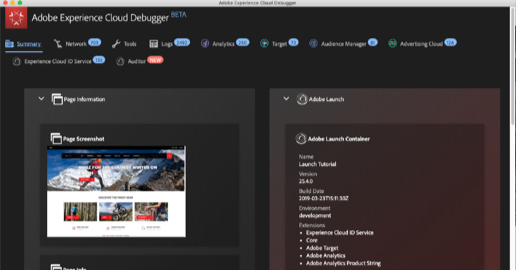</a> <a href="debugger/use-the-experience-cloud-debugger.md">Use the Adobe Experience Cloud Debugger</a></td>
  <td><a href="https://docs.adobe.com/content/help/en/target-learn/tutorials/troubleshooting/troubleshoot-with-the-experience-cloud-debugger.html">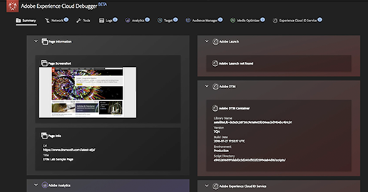</a> <a href="https://docs.adobe.com/content/help/en/target-learn/tutorials/troubleshooting/troubleshoot-with-the-experience-cloud-debugger.html">Troubleshoot Target</a></td>
  <td><a href="https://docs.adobe.com/content/help/en/target-learn/tutorials/troubleshooting/troubleshoot-with-target-traces.html">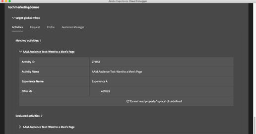</a> <a href="https://docs.adobe.com/content/help/en/target-learn/tutorials/troubleshooting/troubleshoot-with-target-traces.html">Troubleshoot with Target Traces</a></td>
  <td> <a href="https://docs.adobe.com/content/help/en/experience-cloud/implementing-in-websites-with-launch/configure-launch/launch-switch-environments.html">Switch Launch Environments</a></td>
</tr>
</table>

_Apple, the Apple logo, iPad, iPhone, iPod, and iPod touch are trademarks of Apple Inc., registered in the U.S. and other countries. Swift and the Swift logo are trademarks of Apple Inc. 
Android is a trademark of Google LLC._